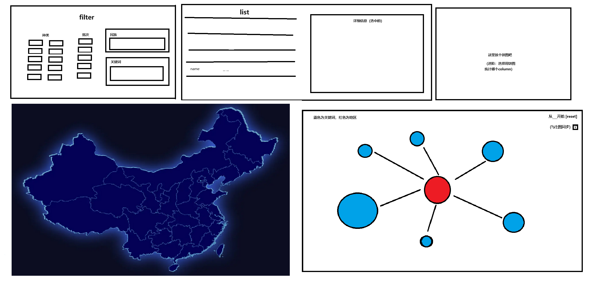
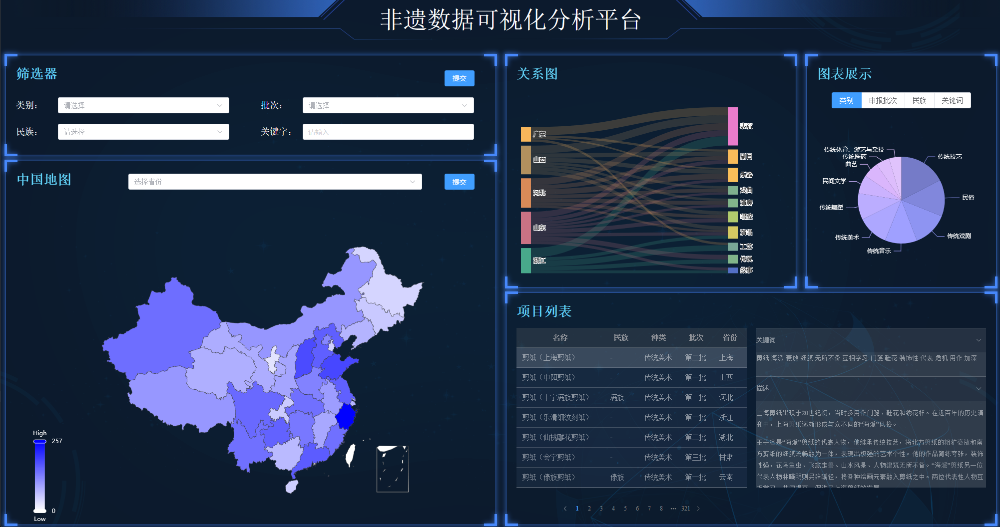

# 布局图
## 第一版

## 第二版实际效果

# 模块1 filter
筛选种类，批次，民族，关键词等信息。  
设置提交的时候向服务器发送post请求以更改筛选条件，
API见[这里](backend/api.md#post-filter)。

# 模块2 地图
以省为交互单位  
可以点选以筛选；点选后的地权会用紫色线条描边。  
地图同时作为热力图。热度值代表筛选出的条目数量。  
在筛选条件更新的时候会向服务器发送get请求以更新数据，
API见[这里](backend/api.md#get-heat)。

# 模块3 List
显示筛选出的条目  
列表的条目可以点选以查看详情，详情显示在右侧，包括关键词和描述。  
有特定的算法进行排序，有些条目的实质内容有重复，会合并显示。  
列表的条目被点选后有细小颜色变化，如果没有点选，默认选择第一个。  
在筛选条件更新的时候会向服务器发送get请求以更新数据，
API见[这里](backend/api.md#get-list)。

# 模块4 自由图表
设置选项，可以选择不同的图表（共四种：类别，批次，民族，关键词）。  
点击图表中的项目时，会直接快捷添加/移除该项的筛选条件。
需要的时候向服务器发送get请求以获取数据。
在筛选条件更新的时候会向服务器发送get请求以更新数据，
API见[这里](backend/api.md#get-chart)。

# 模块5 关系图
## 第一版本（已废弃）
用不同颜色的圈表示地区和关键词  
可以考虑用圈的大小等信息代表权重（即条目数量）  
可选择一个特定的地区或者关键词，选中的圈置于中间，其他圈围绕中间圈排列  
点击圈可以选中  
可以输入特定的地区或者关键词来进行选中（比如于右上角放置一个输入框）  
可以考虑着和左侧地图进行少许联动  
需要的时候向服务器发送get请求以获取数据
## 第二版本
直接使用sankey图，左侧省份，右侧关键词。  
根据筛选出的数据，选出特定数量上限的省份和关键词（优先选择出现次数多的），来绘制sankey图。  
前端在数据更新提交时会调用后端接口，后端返回数据，前端根据数据更新sankey图。  
API见[这里](backend/api.md#get-rel)